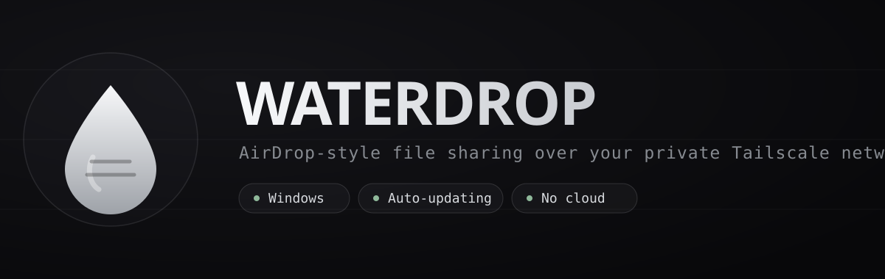
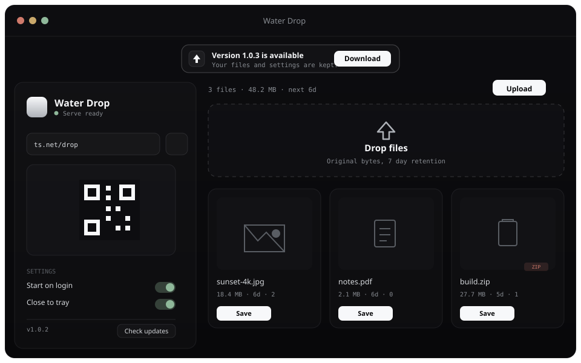

<p align="center">
  
</p>

<p align="center">
  <a href="https://github.com/MusicMaster4/WaterDrop/releases/latest"></a>
  <a href="https://github.com/MusicMaster4/WaterDrop/actions/workflows/release.yml"></a>
  
  
</p>

<p align="center">
  <b>AirDrop-style private file sharing over your own Tailscale network.</b><br/>
  Drop a file on your PC, scan a QR code with your phone, grab it. No accounts, no public links, no cloud in the middle.
</p>

---

## Install (the easy way)

**Just want to use it? Download the installer — you don't need anything technical.**

➡️ **[Download the latest Windows installer](https://github.com/MusicMaster4/WaterDrop/releases/latest)**

- Download `Water-Drop-<version>-Setup.exe` and run it.
- Pick where to install it (or accept the default) and finish the wizard.
- Water Drop **updates itself from inside** (see [Updates](#updates)) — so you only ever download it once.

> The build is currently unsigned, so Windows SmartScreen may show a
> *"Windows protected your PC"* notice the first time. Click **More info →
> Run anyway**. This is expected for indie apps without a paid code-signing
> certificate.

### The one thing you need: Tailscale

Water Drop uses [Tailscale](https://tailscale.com/download) to build a private
tunnel between your computer and your phone. It's free for personal use.

1. Install Tailscale on **this computer** and sign in.
2. Install Tailscale on **your phone** and sign in to the **same account**.
3. Keep it connected on both.

Water Drop still works **locally** without Tailscale — you just won't be able to
reach the shelf from your phone until the tailnet is connected.

---

## What it looks like

<p align="center">
  
</p>

The whole app is a single surface that adapts:

- **On your PC** — a wide two-pane desktop app: connection + QR + settings on the
  left, your drop shelf on the right.
- **On your phone** — the same shelf, in your browser, after scanning the QR.

---

## Using it

1. Open Water Drop on your computer. It shows your private link and a **QR code**.
2. If `/drop` isn't published on your tailnet yet, click **Publish** once. Under
   the hood it runs:
   ```powershell
   tailscale serve --bg --yes --set-path /drop http://127.0.0.1:<port>
   ```
3. On your phone, **scan the QR** (the camera app is enough). It opens your
   private shelf — no typing, no login.
4. Drop files from either side:
   - **Drag & drop** files onto the window (or the phone page), or click
     **Upload**.
   - On the desktop you can **drag a file card straight out** of Water Drop into
     any folder or app.
   - Tap **Save / Get** to download to your chosen folder.

Files keep their **original bytes** (each shows a SHA-256 hash) and stay on the
shelf for **7 days**, then expire automatically.

Water Drop keeps running quietly in the **system tray** so your phone can still
reach the shelf when the window is closed. Use the tray icon → **Quit** to stop
it completely.

---

## Settings

Open the app window to find:

- **Start on login** — launch Water Drop (silently, to the tray) when your
  computer boots.
- **Close to tray** — closing the window keeps the server running in the
  background instead of quitting.
- **Download folder** — choose where saved files land.
- **Check for updates** — see your version and look for a new one on demand.

### Updates

When a new version is published, Water Drop tells you right inside the app with a
banner at the top:

> **Version X.Y.Z is available** → click **Download** → then **Install &
> Restart**.

It downloads in the background, then swaps itself in and reopens — **your files,
folder choice, and settings are all preserved**. No reinstalling.

---

## A note on privacy

Water Drop only serves files to **loopback (this PC) and your own Tailscale
network** — never the public internet.

- Don't share your QR code or the `/drop` link with people you don't trust on
  your tailnet.
- Files auto-expire after 7 days; you can also **Clear** the shelf at any time.
- Everything stays on your machine — there's no external server, account, or
  analytics.

---
---

## For developers (building from source)

Everything below is optional — only needed if you want to build the app yourself
or hack on it.

### How it's built

Water Drop is a single **Electron desktop app**:

- **`src/main/`** — the Electron main process: windowing, tray, single-instance
  lock, login-item handling, and the [in-app updater](src/main/updater.js).
- **`src/server/`** — a tiny local HTTP server (`dropServer.js`) that stores
  files, serves the shelf UI, and exposes the JSON API on `127.0.0.1`.
- **`src/renderer/`** — the React UI (Vite), served both to the desktop window
  and to your phone's browser. The same code renders both.
- **`src/main/tailscale.js`** — detects Tailscale and publishes `/drop` with
  `tailscale serve`.

### Run it from source

```powershell
git clone https://github.com/MusicMaster4/WaterDrop.git water-drop
cd water-drop
npm install
npm start          # builds the renderer and launches Electron
```

For live renderer development (hot reload):

```powershell
npm run dev
```

### Build the installer locally

```powershell
npm run dist       # -> release/Water-Drop-<version>-Setup.exe
```

### Releasing (automated + self-versioning)

Releases **build and bump their own version** — you never edit a version by hand.

- **Every push to `main`** (that touches code) triggers
  [`.github/workflows/release.yml`](.github/workflows/release.yml). It computes
  the next version (latest release **+ 0.0.1**), builds the Windows installer,
  and publishes a **GitHub Release** with auto-update metadata (`latest.yml`).
  Installed clients then see the update in-app.
- Prefer to trigger manually? **Actions → "Build & Release" → Run workflow**, and
  pick `patch` / `minor` / `major` from the dropdown.
- Need an **exact** version once? Set it in `package.json` (higher than the
  latest release) and run the workflow — that version is used as-is.
- Uncheck **publish** in the manual run for a **test build** (uploads the
  installer as a workflow artifact, no release, no version bump).

The version numbering rolls like an odometer: patch fills `0 → 99`, then carries
into minor (`1.0.99 → 1.1.0`); minor fills `0 → 9`, then carries into major
(`1.9.99 → 2.0.0`). All versions stay valid semver so `electron-updater` accepts
them.

> Windows auto-update works out of the box, even unsigned. Signing only removes
> the SmartScreen prompt — add a certificate and the `CSC_LINK` /
> `CSC_KEY_PASSWORD` secrets later if you want that.

---

## License

**Custom non-commercial license.** You may use, copy, modify, and distribute
Water Drop for personal, educational, evaluation, or internal purposes — but you
**may not sell it, monetize it, or sell any modified/derivative version** without
prior written permission. See [LICENSE](LICENSE) for the full terms.
