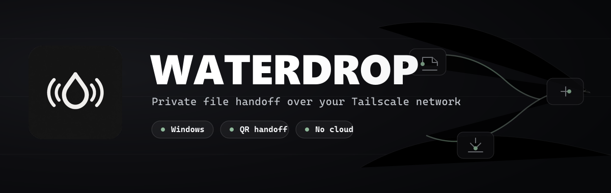
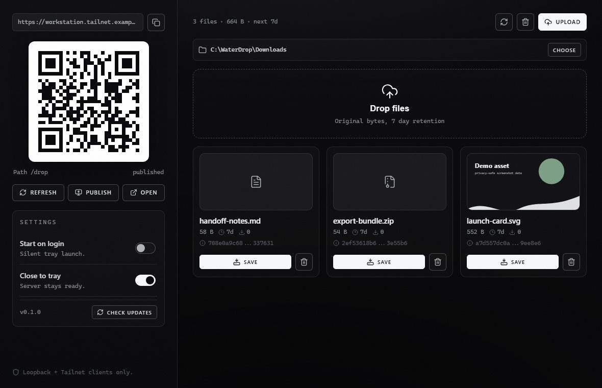
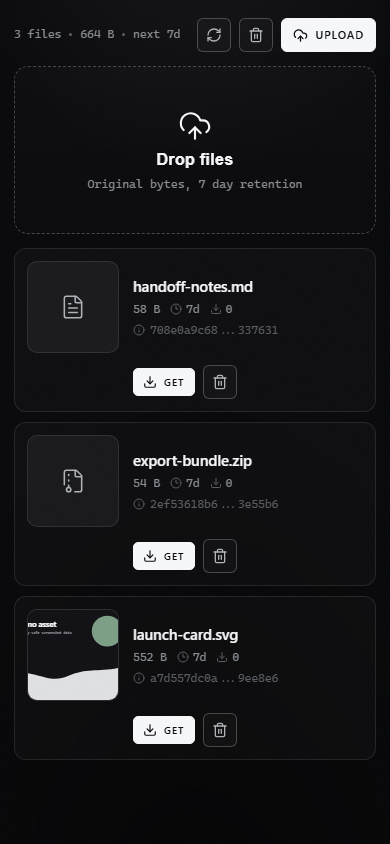
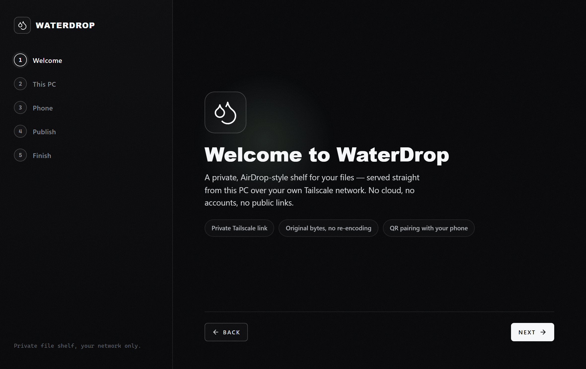
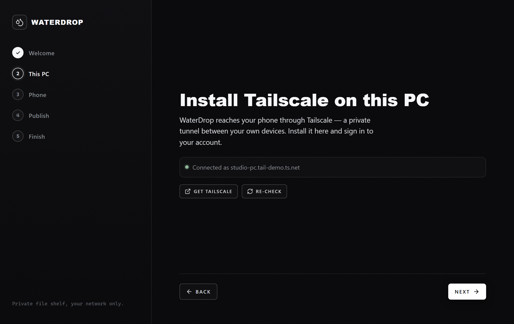
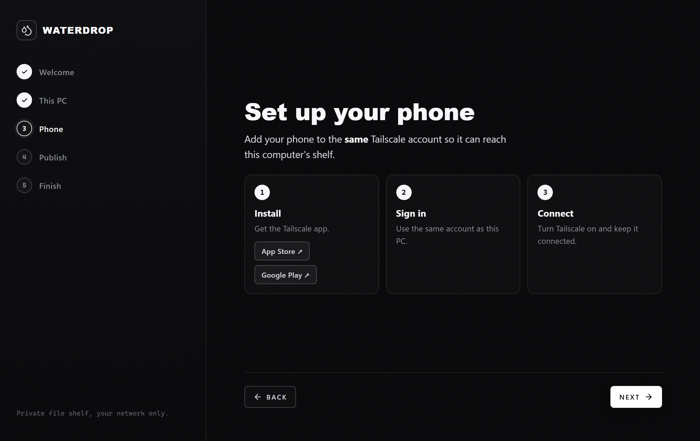
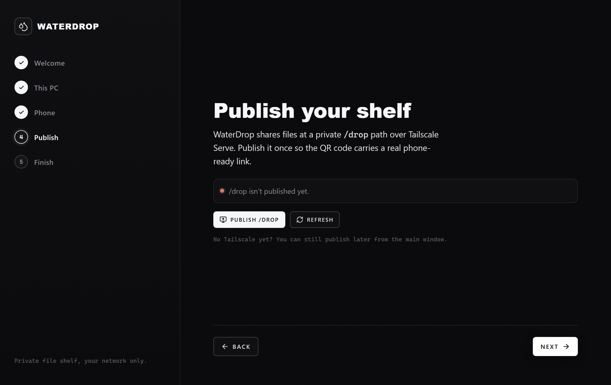
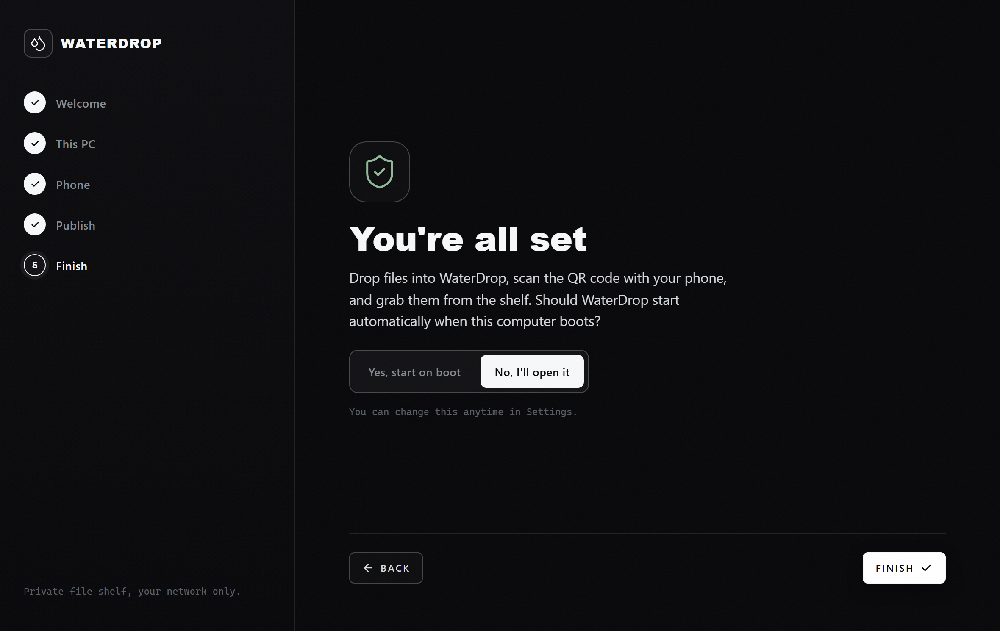

<p align="center">
  
</p>

<p align="center">
  <a href="https://github.com/MusicMaster4/WaterDrop/releases/latest"></a>
  <a href="https://github.com/MusicMaster4/WaterDrop/actions/workflows/release.yml"></a>
  
  
</p>

<p align="center">
  <b>Private AirDrop-style file sharing for your Tailscale network.</b><br />
  Drop files on your PC, scan a QR code with your phone, and download them from a private shelf. No cloud storage, no public links, no account.
</p>

## What WaterDrop Does

WaterDrop is a small Windows desktop app for moving files between your computer and devices on the same Tailscale tailnet.

- Share files through a private `/drop/` shelf served from your own PC.
- Upload from desktop or phone without transcoding, compression, or quality loss.
- Download, preview, delete, and clear files from a responsive browser UI.
- Keep each file's original bytes and show its SHA-256 hash.
- Auto-expire files after 7 days.
- Keep serving from the system tray when the window is closed.

## Screenshots

These screenshots are captured from the real app using synthetic demo files and an example tailnet URL.

<p align="center">
  
</p>

<p align="center">
  
</p>

## Install

Download the latest Windows installer from GitHub Releases:

**[Download WaterDrop for Windows](https://github.com/MusicMaster4/WaterDrop/releases/latest)**

1. Download `WaterDrop-<version>-Setup.exe`.
2. Run the installer and choose the install location.
3. Open WaterDrop and keep Tailscale connected on the devices you want to use.

The installer is currently unsigned. Windows SmartScreen may show "Windows protected your PC" on first launch. Choose **More info** and then **Run anyway** if you trust this build.

## Tailscale Requirement

WaterDrop uses [Tailscale](https://tailscale.com/download) to make your PC reachable from your own devices without exposing the shelf to the public internet.

1. Install Tailscale on your Windows PC and sign in.
2. Install Tailscale on your phone or other device and sign in to the same account.
3. Keep Tailscale connected on both devices.

WaterDrop can still run locally without Tailscale, but the phone QR flow needs a connected tailnet.

## First-Time Setup

The first time you open WaterDrop, a short setup guide walks you from install to
your first drop. You can re-run it anytime from **Settings → Re-run setup**.

These screenshots are captured from the real app using an example tailnet URL —
no personal data.

### 1. Welcome

<p align="center">
  
</p>

### 2. Install Tailscale on this PC

WaterDrop checks that Tailscale is installed, signed in, and connected. Use
**Re-check** after you install or connect it.

<p align="center">
  
</p>

### 3. Set up your phone

Add your phone to the same Tailscale account so it can reach this computer's shelf.

<p align="center">
  
</p>

### 4. Publish your shelf

Publish the private `/drop` path once so the QR code carries a real,
phone-ready HTTPS link over Tailscale Serve.

<p align="center">
  
</p>

### 5. Finish

Choose whether WaterDrop starts automatically at boot, then you land on the
shelf ready to drop files.

<p align="center">
  
</p>

## How To Use

1. Open WaterDrop on your PC.
2. If `/drop` is not published yet, click **Publish** once.
3. Scan the QR code with your phone.
4. Upload files by dragging them into the app or tapping **Upload**.
5. Download files with **Save** on desktop or **Get** on mobile.

When WaterDrop publishes `/drop`, it runs:

```powershell
tailscale serve --bg --yes --set-path /drop http://127.0.0.1:<port>
```

On desktop, file cards can also be dragged out of WaterDrop into another folder or app.

## Privacy Model

WaterDrop is designed for private, short-lived handoff, not public file hosting.

- The server accepts loopback and Tailscale client addresses only.
- Files stay on your machine.
- No external WaterDrop server, account, analytics, or cloud storage is used.
- The QR code and `/drop/` link should only be shared with people you trust on your tailnet.
- Files expire after 7 days, and the shelf can be cleared manually at any time.

## Updates

WaterDrop checks for GitHub Releases from inside the installed app. When a new version is available, it can download the update and restart into the new version while preserving your settings, shelf data, and download folder.

## Build From Source

WaterDrop is an Electron app with a React/Vite renderer and a local Node HTTP file server.

```powershell
git clone https://github.com/MusicMaster4/WaterDrop.git waterdrop
cd waterdrop
npm install
npm start
```

For live renderer development:

```powershell
npm run dev
```

Run tests:

```powershell
npm test
```

Build the Windows installer:

```powershell
npm run dist
```

The installer is written to `release/` as `WaterDrop-<version>-Setup.exe`.

## Project Structure

- `src/main/` - Electron main process, tray behavior, app settings, Tailscale integration, and updater bridge.
- `src/server/` - local HTTP server, upload/download API, file metadata, retention cleanup, and static renderer serving.
- `src/renderer/` - React UI used by both the desktop window and the phone browser page.
- `.github/workflows/release.yml` - automated Windows build and GitHub Release publishing.

## Release Flow

Pushes to `main` or `master` that touch app code trigger the release workflow. The workflow resolves the next version, builds the Windows installer, uploads update metadata, and publishes a GitHub Release.

Manual workflow runs can publish a `patch`, `minor`, or `major` release, or produce a test build artifact without publishing.

## License

WaterDrop uses a custom non-commercial license. You may use, copy, modify, and distribute it for personal, educational, evaluation, or internal purposes, but you may not sell, monetize, or sell modified versions without prior written permission. See [LICENSE](LICENSE).
